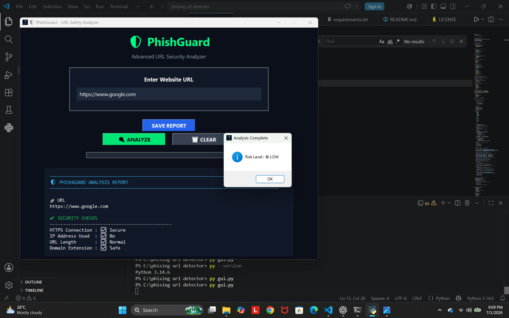

# 🛡 PhishGuard: Phishing URL Detection System

## 📌 Project Overview

PhishGuard is a desktop application developed using Python that analyzes website URLs and identifies potentially suspicious or phishing links using rule-based security checks.

---

## ✨ Features

- 🔍 URL Risk Analysis
- 🛡 Rule-Based Phishing Detection
- 📊 Risk Score Calculation
- 🟢🟡🔴 Color-Coded Risk Levels
- 📈 Progress Bar Visualization
- 💾 Save Report as Text File
- 🖥 User-Friendly Tkinter GUI

---

## 🛠 Technologies Used

- Python
- Tkinter
- Regular Expressions (`re`)

---

## 🚀 How to Run

1. Make sure Python is installed.
2. Download or clone this project.
3. Open the project folder.
4. Run:

```bash
python gui.py
```

---

## 📖 Detection Method

The application checks URLs using rule-based indicators such as:

- HTTPS availability
- Presence of an IP address
- URL length
- Suspicious keywords
- Suspicious domain extensions

Based on these checks, it calculates a risk score and classifies the URL as:

- 🟢 Low Risk
- 🟡 Medium Risk
- 🔴 High Risk

---

## 📸 Screenshot



---

## 👨‍💻 Author

Dibyasa Sahoo
